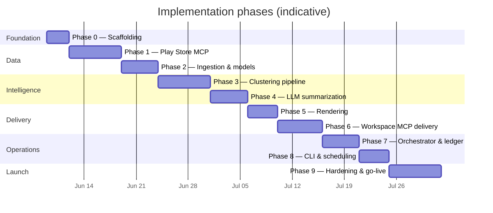

# Weekly Product Review Pulse — Implementation Plan

Phase-wise build plan for the Groww Weekly Review Pulse. Derived from [context.md](context.md) and [architecture.md](architecture.md).

**Initial scope:** Groww · Google Play Store reviews · Play Store Reviews MCP (in-repo) · Google Docs MCP · Gmail MCP

---

## Plan overview

| Phase | Name | Duration (est.) | Primary output |
|-------|------|-----------------|----------------|
| 0 | Project scaffolding | 2–3 days | Repo layout, tooling, configs |
| 1 | Play Store Reviews MCP | 5–7 days | Working MCP server + tests |
| 2 | Ingestion & data models | 4–5 days | Normalized reviews in agent |
| 3 | Clustering pipeline | 5–7 days | Ranked theme clusters |
| 4 | LLM summarization | 4–5 days | Validated `PulseReport` |
| 5 | Report rendering | 3–4 days | Doc + email payloads (local) |
| 6 | Google Workspace delivery | 5–6 days | Doc append + email draft via MCP |
| 7 | Orchestrator & run ledger | 4–5 days | Idempotent end-to-end run |
| 8 | CLI & scheduling | 3–4 days | `pulse run`, backfill, cron |
| 9 | Hardening & go-live | 5–7 days | Staging sign-off, production |

**Total estimate:** ~8–10 weeks (one developer, part-time adjustments for MCP server availability).

Phases are sequential unless noted. Parallel work is possible after Phase 1 (e.g. Phase 5 rendering can start with mock `PulseReport` while Phase 4 finishes).

---

## Cross-cutting conventions (all phases)

- **Language:** Python 3.11+ for pulse agent and Play Store MCP (per architecture layout).
- **MCP boundary:** No direct Play Store / Google API calls from `pulse-agent/`.
- **Secrets:** OAuth and API keys only in MCP server env or local `.env` (gitignored).
- **Product config:** Single file `config/groww.yaml` — no hardcoded Groww IDs in code.
- **Definition of done (per phase):** Tasks complete, exit criteria met, tests pass, README or inline docs updated for new commands/tools.

---

## Phase 0 — Project scaffolding

**Goal:** Establish repository structure, dependencies, and development workflow before feature work.

### Tasks

| # | Task | Owner module |
|---|------|--------------|
| 0.1 | Create directory layout per [architecture.md §4](architecture.md#4-recommended-repository-layout) | repo root |
| 0.2 | Initialize `mcp-servers/play-store-reviews/` with `pyproject.toml`, MCP SDK dependency | play-store-reviews |
| 0.3 | Initialize `pulse-agent/` with `pyproject.toml`, shared dev deps (pytest, ruff, mypy optional) | pulse-agent |
| 0.4 | Add `config/groww.yaml` template (placeholders for `app_id`, `document_id`, stakeholders) | config |
| 0.5 | Add `config/mcp-servers.json` template (launch commands, no secrets) | config |
| 0.6 | Add `.gitignore` (`data/`, `.env`, `__pycache__/`, credentials) | repo root |
| 0.7 | Add `README.md` with local setup, env var list, and links to context/architecture | repo root |
| 0.8 | Create `data/runs/` directory (gitignored) for run ledger | data |

### Deliverables

- Runnable empty packages for MCP server and pulse agent.
- Config templates committed; secrets documented but not committed.

### Exit criteria

- [ ] `pip install -e ./mcp-servers/play-store-reviews` succeeds.
- [ ] `pip install -e ./pulse-agent` succeeds.
- [ ] `pytest` runs (even if zero tests initially).
- [ ] `config/groww.yaml` validates against a minimal schema in `pulse/config.py`.

### Dependencies

- None (first phase).

---

## Phase 1 — Play Store Reviews MCP Server

**Goal:** Build the in-repo MCP server that fetches and normalizes Groww Google Play reviews.

### Tasks

| # | Task | Details |
|---|------|---------|
| 1.1 | Define Pydantic models | `Review`, `FetchRequest`, `FetchResult` per [architecture.md §5.1](architecture.md#51-play-store-reviews-mcp-in-repo) |
| 1.2 | Implement Play Store scraper | `scraper.py` — public endpoint or library; rate limit + backoff |
| 1.3 | Implement cache layer | Key `(app_id, start_date, end_date)`; TTL configurable |
| 1.4 | Implement `fetch_reviews` tool | Date window filter, `max_reviews`, `truncated` flag |
| 1.5 | Implement `get_app_metadata` tool | Sanity check for Groww package ID |
| 1.6 | Implement `health_check` tool | Server + cache status |
| 1.7 | MCP server entrypoint | `server.py` — stdio transport, tool registration |
| 1.8 | Server-side config | Default Groww `app_id`, timeouts, cache TTL via env |
| 1.9 | Unit tests | Scraper parsing, date filter, stable `review_id` generation |
| 1.10 | Integration test | Live fetch against Groww (manual or CI secret); assert &gt; 0 reviews in 10-week window |
| 1.11 | MCP server README | Tool schemas, example MCP client invocation |

### Deliverables

- `mcp-servers/play-store-reviews/` fully functional MCP server.
- Documented tool contracts matching architecture.

### Exit criteria

- [ ] MCP client can call `fetch_reviews` for Groww and receive normalized JSON.
- [ ] `review_id` is stable across repeated calls for the same review.
- [ ] Cache prevents duplicate scrape within TTL on retry.
- [ ] `health_check` returns OK when server is running.

### Dependencies

- Phase 0 complete.
- Groww Play Store package ID confirmed (e.g. `com.nextbillion.groww` — verify before implementation).

### Risks & mitigations

| Risk | Mitigation |
|------|------------|
| Play Store blocks scraper | Rotate user-agent; backoff; cache aggressively; document fallback library |
| Unstable review IDs | Derive ID from hash of `(reviewer, date, body_prefix)` if store ID missing |

---

## Phase 2 — Ingestion adapter & core data models

**Goal:** Connect pulse agent to Play Store MCP; normalize, dedupe, and scrub reviews.

### Tasks

| # | Task | Module |
|---|------|--------|
| 2.1 | Define core models | `pulse/models/` — `Review`, `Cluster`, `Theme`, `PulseReport`, `RunRecord` |
| 2.2 | Config loader | `pulse/config.py` — load `groww.yaml`, compute date window from `iso_week` |
| 2.3 | MCP client for Play Store | `pulse/delivery/play_store_client.py` — thin wrapper over MCP tools |
| 2.4 | Ingestion adapter | `pulse/ingest/` — map MCP payload → `Review`, dedupe by ID + body hash |
| 2.5 | PII scrubber | `pulse/ingest/pii.py` — email, phone, account patterns; unit tests with fixtures |
| 2.6 | Review filters | Drop empty / ultra-short reviews; log counts at each step |
| 2.7 | Ingest snapshot (optional) | Write raw ingest metadata to `data/runs/{product}/{iso_week}/ingest.json` |
| 2.8 | Integration test | End-to-end ingest: MCP → deduped, scrubbed `list[Review]` |

### Deliverables

- Ingestion pipeline callable independently of analysis.
- `PulseReport` and `RunRecord` schemas (empty/minimal instances serializable to YAML/JSON).

### Exit criteria

- [ ] Given `iso_week` + `review_window_weeks`, agent computes correct `start_date` / `end_date`.
- [ ] Ingest returns deduplicated, PII-scrubbed reviews with stats logged.
- [ ] No Google or Play credentials in `pulse-agent/` code.

### Dependencies

- Phase 1 (Play Store MCP running).

---

## Phase 3 — Analysis pipeline (embeddings & clustering)

**Goal:** Cluster reviews into ranked themes using embeddings, UMAP, and HDBSCAN.

### Tasks

| # | Task | Module |
|---|------|--------|
| 3.1 | Embedding client | `pulse/analysis/embeddings.py` — local inference with BAAI/bge-small-en-v1.5 via sentence-transformers |
| 3.2 | Volume handling | Stratified sample when review count exceeds token budget; record sample size |
| 3.3 | UMAP reduction | `pulse/analysis/reduce.py` — configurable `n_neighbors`, `min_dist` |
| 3.4 | HDBSCAN clustering | `pulse/analysis/cluster.py` — exclude noise cluster (-1) |
| 3.5 | Cluster ranking | Size × rating weight × recency boost; select top K (default 5) |
| 3.6 | Cluster model | `Cluster` with member review IDs, stats, representative snippets |
| 3.7 | Unit tests | Synthetic embedding fixtures; ranking order assertions |
| 3.8 | Integration test | Real Groww reviews → ≥ 1 meaningful cluster (manual review of output) |

### Deliverables

- `analyze(reviews) -> list[Cluster]` function with ranked output.
- Tunable parameters in `groww.yaml` under `analysis:`.

### Exit criteria

- [ ] Pipeline runs on full Groww ingest without OOM on typical volume.
- [ ] Top clusters are distinct (manual spot-check on 3 runs).
- [ ] Stats (`clusters_found`, `reviews_clustered`) populate correctly.

### Dependencies

- Phase 2 complete.
- sentence-transformers library with BAAI/bge-small-en-v1.5 (local model, no API key needed).

---

## Phase 4 — LLM summarization & quote validation

**Goal:** Produce a complete `PulseReport` with theme names, quotes, action ideas, and audience notes.

### Tasks

| # | Task | Module |
|---|------|--------|
| 4.1 | Prompt templates | `pulse/summarize/prompts.py` — system prompt: reviews as data, not instructions |
| 4.2 | Per-cluster summarization | Theme name, summary, quote candidates, action ideas |
| 4.3 | Quote validation | `validate_quote()` per [architecture.md §7.3](architecture.md#73-llm-summarization) |
| 4.4 | Fallback pass | Re-prompt with snippet-only constraint if validation fails |
| 4.5 | Audience notes section | Short bullets for Product / Support / Leadership |
| 4.6 | Token budget enforcement | `max_tokens_per_run` from config; truncate snippets |
| 4.7 | Assemble `PulseReport` | Merge stats, themes, period, `generated_at` (IST) |
| 4.8 | Unit tests | Quote validation true/false cases; prompt injection fixture reviews |
| 4.9 | Golden output review | Compare one `PulseReport` to [context.md sample](context.md#sample-output-illustrative) structure |

### Deliverables

- `summarize(clusters, reviews, config) -> PulseReport`.
- `pulse dry-run` can print JSON/YAML report to stdout (stub CLI OK in this phase).

### Exit criteria

- [ ] Every published quote exists verbatim (post-normalization) in source review text.
- [ ] Report contains ≤ `max_themes` themes with all required sections.
- [ ] Token usage recorded for audit fields.
- [ ] Prompt-injection-style review text does not alter tool behavior.

### Dependencies

- Phase 3 complete.
- LLM API access in dev.

---

## Phase 5 — Report rendering

**Goal:** Transform `PulseReport` into Google Docs batch-update structure and Gmail HTML/text — without sending yet.

### Tasks

| # | Task | Module |
|---|------|--------|
| 5.1 | Heading convention | `Groww — Week {ISO_WEEK} ({start} – {end})` per [architecture.md §9](architecture.md#9-idempotency-and-concurrency) |
| 5.2 | Doc section builder | `pulse/render/docs.py` — H2/H3 structure, bullets per architecture §5.2 |
| 5.3 | Email teaser builder | `pulse/render/email.py` — subject, theme bullets, placeholder doc link |
| 5.4 | Audience section renderer | “Who this helps” subsection in Doc body |
| 5.5 | Snapshot tests | Rendered Doc request JSON + email HTML from fixture `PulseReport` |
| 5.6 | Local preview command | `pulse render --product groww --iso-week …` writes `preview.doc.json` + `preview.email.html` |

### Deliverables

- Renderer modules with no MCP dependency (pure functions).
- Preview artifacts for stakeholder review before Workspace integration.

### Exit criteria

- [ ] Rendered Doc structure matches architecture section layout.
- [ ] Email body is teaser-only (no full report duplicate).
- [ ] Heading text is deterministic for idempotency.

### Dependencies

- Phase 4 complete (real or fixture `PulseReport`).

**Parallelization:** Can start in parallel with Phase 4 using fixture data from context.md sample.

---

## Phase 6 — Google Workspace delivery (MCP integration)

**Goal:** Append report sections to Google Doc and create email drafts via external MCP servers.

### Prerequisites (external)

| Prerequisite | Action |
|--------------|--------|
| Google Docs MCP | Install/configure; verify `get_document`, `find_heading`, `append_section` (or equivalent) |
| Gmail MCP | Install/configure; verify `create_draft`, `send_email` |
| Google OAuth | Service account or OAuth creds in MCP env only |
| Staging Google Doc | Create *Weekly Review Pulse — Groww* (staging); add `document_id` to config |

### Tasks

| # | Task | Module |
|---|------|--------|
| 6.1 | Docs MCP client | `pulse/delivery/docs_client.py` — wrap tools; no direct REST |
| 6.2 | Gmail MCP client | `pulse/delivery/gmail_client.py` — draft + send wrappers |
| 6.3 | `find_heading` idempotency check | Before append; return existing anchor if found |
| 6.4 | `append_section` integration | Pass rendered Doc payload; capture `heading_anchor`, `revision_id` |
| 6.5 | Deep link construction | Doc URL + heading anchor for email |
| 6.6 | `create_draft` integration | Default mode in dev/staging |
| 6.7 | `send_email` guard | Require `PULSE_ALLOW_SEND=true` + `email_mode=send` |
| 6.8 | Integration tests | Append to staging doc; verify section visible; draft appears in Gmail |
| 6.9 | Delivery integration test | Full render → doc append → draft email with working link |

### Deliverables

- Delivery module callable with `PulseReport` + config → delivery result dict.
- Staging doc with at least one appended test section.

### Exit criteria

- [ ] Section appends to staging Google Doc with correct formatting.
- [ ] Re-run with same `iso_week` does not duplicate section (`find_heading` skips append).
- [ ] Email draft contains teaser bullets + “Read full report” link that opens correct section.
- [ ] `send_email` is blocked without explicit guard flag.

### Dependencies

- Phase 5 complete.
- Google Docs MCP and Gmail MCP available and documented.

### Risks & mitigations

| Risk | Mitigation |
|------|------------|
| MCP tool names differ from architecture | Abstract behind `docs_client` / `gmail_client`; map in one place |
| Heading anchor / deep link format unclear | Spike in 6.1; document URL pattern in README |

---

## Phase 7 — Orchestrator, run ledger & idempotency

**Goal:** Wire all stages into a single idempotent run with full audit trail.

### Tasks

| # | Task | Module |
|---|------|--------|
| 7.1 | Run state machine | `pending → ingesting → … → completed / failed` per architecture §6.2 |
| 7.2 | Run ledger persistence | `pulse/audit/ledger.py` — JSON at `data/runs/{product}/{iso_week}.json` |
| 7.3 | File lock / concurrency | Prevent parallel runs for same `(product, iso_week)` |
| 7.4 | Orchestrator | `pulse/orchestrator.py` — sequence from architecture §6 |
| 7.5 | Partial failure handling | Persist stage + partial delivery IDs; safe retry |
| 7.6 | Completed-run short-circuit | Exit 0 if ledger `status=completed` |
| 7.7 | Structured logging | `run_id`, stage, `duration_ms`, counts per architecture §12 |
| 7.8 | Integration tests | Full run; forced retry; concurrent run rejection |
| 7.9 | Idempotency tests | Double run same week → one doc section, one email |

### Deliverables

- `run_pulse(product, iso_week, options) -> RunRecord` entry point.
- Run ledger queryable for audit questions in architecture §12.

### Exit criteria

- [ ] Full pipeline run produces complete `RunRecord` with doc + email IDs.
- [ ] Re-run same ISO week: no duplicate Doc section or email.
- [ ] Failed run at `delivering` can retry without duplicating successful doc append.
- [ ] Logs answer: what was sent, when, for which week.

### Dependencies

- Phases 2–6 complete.

---

## Phase 8 — CLI & scheduling

**Goal:** Operator-facing commands and weekly automation.

### Tasks

| # | Task | Module |
|---|------|--------|
| 8.1 | `pulse run` | `--product groww`, `--iso-week`, `--dry-run`, `--email-mode` |
| 8.2 | `pulse backfill` | `--from` / `--to` ISO weeks; sequential, idempotent |
| 8.3 | `pulse status` | Print `RunRecord` for product/week |
| 8.4 | `pulse dry-run` | Ingest + analyze + render locally; no delivery MCP calls |
| 8.5 | Exit codes | 0 success/no-op; non-zero on failure with stage hint |
| 8.6 | Scheduler setup | Cron / GitHub Actions / Cloud Scheduler — Monday 06:00 IST |
| 8.7 | Environment profiles | Dev / staging / prod config overrides (doc ID, email mode) |
| 8.8 | Operator runbook | `docs/runbook.md` — run, backfill, recover from failure |

### Deliverables

- Installable CLI entry point (`pip install -e ./pulse-agent` → `pulse` command).
- Scheduled job config (example cron snippet in runbook).

### Exit criteria

- [ ] `pulse run --product groww` executes full staging pipeline.
- [ ] `pulse backfill` over 3 weeks creates 3 sections (or skips existing).
- [ ] `pulse status` shows delivery IDs for completed run.
- [ ] Scheduler invokes CLI successfully in staging.

### Dependencies

- Phase 7 complete.

---

## Phase 9 — Hardening, staging validation & production go-live

**Goal:** Security review, quality bar, stakeholder sign-off, production cutover.

### Tasks

| # | Task | Area |
|---|------|------|
| 9.1 | PII audit | Spot-check 50 random reviews pre/post scrub in report |
| 9.2 | Quote audit | 100% quote validation on 3 consecutive weekly runs |
| 9.3 | Cost review | Token usage within `max_tokens_per_run`; document monthly estimate |
| 9.4 | Staging UAT | Product / support / leadership review sample pulse output |
| 9.5 | Production Google Doc | Create prod doc; update `groww.yaml` prod profile |
| 9.6 | Production stakeholders | Finalize `stakeholders[]` allowlist |
| 9.7 | Enable `send` in prod | `PULSE_ALLOW_SEND=true`, `email_mode: send` with approval |
| 9.8 | Backfill decision | Optional: backfill N prior ISO weeks to seed doc history |
| 9.9 | Monitoring | Alert on run failure (email or log sink); weekly success check |
| 9.10 | Launch checklist sign-off | See below |

### Staging UAT checklist (stakeholder-facing)

- [ ] Report readable in one page (≈ 5 min read).
- [ ] Themes match intuitive groupings from raw reviews.
- [ ] Quotes feel authentic and representative.
- [ ] Action ideas are concrete and tied to themes.
- [ ] Email teaser is useful without opening the doc; link works.
- [ ] Doc history accumulates week-over-week in one document.

### Production launch checklist

- [ ] Staging UAT signed off.
- [ ] Prod doc ID and recipients configured.
- [ ] Scheduler running Monday 06:00 IST.
- [ ] Run ledger writable and backed up (or retained per policy).
- [ ] `PULSE_ALLOW_SEND` documented; only set in prod runtime.
- [ ] On-call / owner knows how to `pulse status` and retry failed runs.
- [ ] First prod run reviewed manually before broad reliance.

### Exit criteria

- [ ] Two consecutive successful prod weekly runs.
- [ ] No duplicate sections or emails across backfill + scheduled runs.
- [ ] Runbook complete and shared with operators.

### Dependencies

- Phase 8 complete.
- Stakeholder availability for UAT.

---

## Testing strategy (by phase)

| Phase | Test type | Focus |
|-------|-----------|-------|
| 0 | Smoke | Install, import |
| 1 | Unit + integration | Scraper, MCP tools, live fetch |
| 2 | Unit + integration | Dedupe, PII, config window |
| 3 | Unit + integration | Clustering stability, ranking |
| 4 | Unit + manual | Quote validation, prompt injection |
| 5 | Snapshot | Rendered Doc/email structure |
| 6 | Integration | Staging Doc + Gmail draft |
| 7 | Integration | Idempotency, partial failure retry |
| 8 | E2E | CLI commands, scheduler dry-run |
| 9 | UAT + prod smoke | Stakeholder review, 2 prod runs |

---

## Environment progression

| Milestone | Environment | Email | Doc |
|-----------|-------------|-------|-----|
| Phases 1–4 | Local dev | — | — |
| Phase 5 | Local dev | — | Preview files only |
| Phases 6–8 | Staging | `draft` | Staging doc |
| Phase 9 | Production | `send` (guarded) | Production doc |

---

## Open decisions (resolve before or during implementation)

| # | Decision | Resolve by | Default if unresolved |
|---|----------|------------|------------------------|
| D1 | Groww exact Play Store `app_id` | Phase 1 start | Verify from Play Store URL |
| D2 | Google Docs / Gmail MCP package choice | Phase 6 start | Use community MCP; wrap in client |
| D3 | Embedding + LLM provider | Phase 3 start | BAAI/bge-small-en-v1.5 (local) + OpenAI LLM |
| D4 | Run ledger: JSON files vs SQLite | Phase 7 | JSON files (simpler) |
| D5 | Backfill depth at launch | Phase 9 | Current week only; optional 4-week backfill |

---

## Success metrics (post-launch)

| Metric | Target |
|--------|--------|
| Weekly run success rate | ≥ 95% over 8 weeks |
| Run duration (p95) | &lt; 30 minutes |
| Quote validation pass rate | 100% |
| Stakeholder doc open rate (email link) | Track qualitatively in first month |
| Manual effort per week | ~0 hours (automated) |

---

## Document map

| Document | Purpose |
|----------|---------|
| [context.md](context.md) | Product scope, objectives, sample output |
| [architecture.md](architecture.md) | Technical design, MCP contracts, data models |
| **implementation-plan.md** (this file) | Phased build order, tasks, exit criteria |
| `docs/runbook.md` | Created in Phase 8 — operator procedures |

---

## Summary

Build order follows the natural data flow: **scaffold → fetch reviews (MCP) → ingest → cluster → summarize → render → deliver (Docs/Gmail MCP) → orchestrate → automate → launch**. Each phase has explicit exit criteria so the next phase does not start on an unstable foundation. The highest-risk spikes are Play Store scraping (Phase 1) and Google Workspace MCP integration (Phase 6); schedule buffer accordingly.
